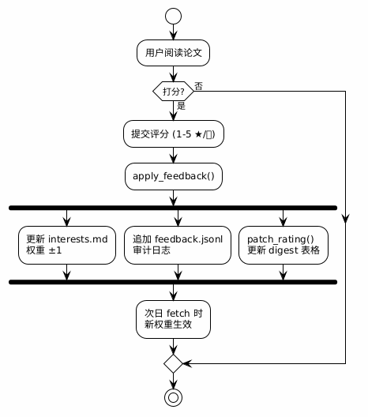

# 核心库详解

> `glean/core.py` — 共享业务逻辑模块（CLI 与 Web 的唯一实现来源）

## 模块职责

`glean/core.py` 包含 **arXiv 日报流水线**的全部纯业务逻辑：抓取、命中标注、digest 生成、
反馈闭环、下载与持久化。它被 `glean/cli.py`（CLI）与 `glean/web/routes.py`（Web）**共同调用**，
因此两端行为完全一致（设计原则 3「CLI 永远是 fallback」的落地方式）。

> 监控线（`watch` / `ccf`）不走这里：它们共享的是
> [监控内核 `glean/monitor.py`](system-design.md)。分层与扩展点见 [系统设计](system-design.md)；
> 文件 schema 见 [数据规范](data-schema.md)。

## 函数索引（与代码一致）

| 函数 | 签名 | 说明 |
|------|------|------|
| `http_get` | `(url, timeout=60) -> bytes` | 带 UA 的 HTTP GET |
| `parse_xml` | `(data) -> Element` | 解析 Atom XML；**拒绝含 DTD/ENTITY 的响应** |
| `fetch_category` | `(cat, start_utc, end_utc, max_results=500) -> list[dict]` | 单类别时间窗查询 |
| `fetch_all` | `(hours) -> (papers, start, end)` | 遍历类别 + 跨类别去重（**纯函数，无落盘副作用**） |
| `load_interest_entries` | `() -> list[dict]` | 解析 `interests.md` |
| `load_interest_keywords` | `() -> (star, expand)` | 拍平关键词 |
| `match_keywords` | `(paper, keywords) -> list[str]` | 整词匹配，返回**命中的关键词** |
| `annotate_hits` | `(papers) -> bool` | 写入 `hits_*` / `score_*` |
| `excerpt` | `(text, limit=400) -> str` | 取前两句，超限按词截断 + ` …` |
| `day_section` | `(day, papers, start, end, cap) -> str` | 生成单日 digest 章节文本 |
| `upsert_digest` | `(day, section) -> None` | 幂等插入/替换该日章节 |
| `find_paper` | `(pid) -> (paper \| None, day \| None)` | 在 `data/*.json` 中按 id 查找（新→旧） |
| `set_entry_weights` | `(new_weights: dict[str, int]) -> None` | 就地重写 `interests.md` 权重行 |
| `patch_rating` | `(pid, symbol, n) -> bool` | 替换 digest 推荐表中的 ★/🧐 串 |
| `apply_feedback` | `(paper, day, stars=None, curiosity=None) -> dict` | **共享核心**：反馈闭环 |
| `reanchor_day` | `(day=None) -> (n_anchor, n_link)` | 补齐分类清单锚点与推荐表跳转链接 |
| `sanitize_title` | `(title) -> str` | LaTeX 记号清理 + 文件系统非法字符清理 |
| `download_paper` | `(pid) -> Path \| None` | 下载并按命名规则落盘 |
| `save_day_data` | `(day, papers, start, end) -> Path` | 写 `data/YYYYMMDD.json` |
| `load_day_data` | `(day) -> dict \| None` | 读 `data/YYYYMMDD.json` |
| `list_available_days` | `() -> list[str]` | 枚举可用日期（倒序） |

---

## 抓取

### `fetch_category(cat, start_utc, end_utc, max_results=500)`

向 arXiv API 发起 `cat:<cat> AND submittedDate:[start TO end]` 查询，归一化返回字段。

**返回**：`list[dict]`，每篇含
`id` · `version` · `title` · `authors[]` · `abstract` · `primary` · `categories[]` · `published` · `abs_url` · `pdf_url`。

**副作用**：仅网络请求（无落盘）。

### `fetch_all(hours)`

对 `config.CATEGORIES`（9 个类别）逐类别调用 `fetch_category`，**按 `id` 跨类别去重**，
每类别之间 `sleep(3)` 以遵守 API 礼仪；单类别失败只打印 `[WARN]` 并继续。

**返回**：`(papers, start, end)`——**注意不是** `(day_str, papers)`。
**副作用**：**无**。落盘发生在 `cmd_fetch`（调用 `save_day_data` + `upsert_digest`）。

---

## 画像与命中

### `load_interest_entries() -> list[dict]`

解析 `interests.md`。返回的每条为：

```python
{"section": "star" | "expand",   # 由 ## 标题子串（兴趣点/扩展点）判定
 "title": str,                   # ### 标题
 "keywords": [str],              # - keywords: 行，按 ";" 分隔
 "weight": int}                  # - weight: 行，缺省 3，钳制 [1,10]
```

> **注意**：`来源:` 行**不**被解析；返回键是 `section`，**不是** `kind`；**没有** `source` 字段。

### `match_keywords(paper, keywords) -> list[str]`

对 `paper["title"] + " " + paper["abstract"]` 做**整词**正则匹配：

```
(?<![A-Za-z0-9])<kw>(?:e?s)?(?![A-Za-z0-9])     # 大小写不敏感，容忍复数 s/es
```

**返回**：命中的关键词列表（**不是** `{star: [...], expand: [...]}` 结构，也不返回条目名）。

### `annotate_hits(papers) -> bool`

对每篇论文，遍历全部条目，按条目所属小节把命中的关键词写入
`hits_star` / `hits_expand`，并把**该条目的 weight 累加**到 `score_star` / `score_expand`。

**返回**：`interests.md` 是否存在条目（据此决定是否打印命中统计）。

---

## Digest 生成

### `day_section(day, papers, start, end, cap) -> str`

生成单日章节：头部（时间窗 + 去重篇数 + 命中统计）→ `### 📌 重点关注` → `### 🧐 视野扩展`
→ `### 分类清单`（每类别一个 `#### cs.XX (n)` + bullet 列表，类别内按 `score_star+score_expand`
降序，超出 `cap` 折叠）。

推荐小节此时为占位符 `_待 agent 分析填写_`。

### `upsert_digest(day, section) -> None`

在 `arXiv-schedule.md` 中按 `<!-- BEGIN day -->` / `<!-- END day -->` **幂等**替换该日章节；
若旧章节里的推荐块已被 agent 填写（非占位符），则**原样回填**，不被脚本覆盖。

---

## 反馈闭环

### `apply_feedback(paper, day, stars=None, curiosity=None) -> dict`

**CLI 与 Web 的共享核心**：

1. 对 `star` / `expand` 两个通道分别处理：`delta = +1 (rating≥4) | -1 (rating≤2) | 0`；
2. 命中该论文的条目权重按 `delta` 调整（钳制 [1,10]）；
3. 调用 `patch_rating` 更新 digest 推荐表中的 ★/🧐 串；
4. 追加一条 `feedback.jsonl` 记录并返回。

**返回**（记录结构）：

```python
{"time": iso8601_utc, "id", "day", "title", "primary",
 "abstract_head": excerpt(abstract, 200),
 "adjustments": [{"kind": "star"|"expand", "rating", "delta",
                  "matched_entries": [条目标题], "digest_updated": bool}],
 "weight_updates": {条目标题: 新权重(int)}}
```

> 字段口径以 [数据规范](data-schema.md) 为准（`kind` 为 `star`/`expand`；`weight_updates` 为
> `{标题: 新权重}`，**不是** `{old, new}`）。

---

## 下载与持久化

### `download_paper(pid) -> Path | None`

先按 `id_list` 查询 arXiv API 取标题/版本/年份，再下载 PDF；**校验响应以 `%PDF` 开头**，
否则丢弃并返回 `None`。落盘命名：

```
arXiv<年份> <id><版本> <去标点标题>.pdf      # 目录 = config.ARXIV_DIR
```

`sanitize_title()` 负责 `\mathbb{X}`→`X`、`\varepsilon`→`epsilon`、去标点/空格归一。

### `save_day_data` / `load_day_data` / `list_available_days`

`data/YYYYMMDD.json` 的写、读、枚举。**现状为直接 `write_text`，未实现原子写入**
（见 [ADR-002 现状标注](../product/decisions/adr-002-file-storage.md)）。

---

## 数据流



> 图源文件：[feedback-loop.puml](../assets/diagrams/feedback-loop.puml)

---

## 安全与稳健要点

| 机制 | 位置 | 作用 |
|------|------|------|
| DTD/ENTITY 拒绝 | `parse_xml` | 防 XML 外部实体注入 |
| `%PDF` 魔数校验 | `download_paper` | 防止把错误页保存成 .pdf |
| 单类别失败容忍 | `fetch_all` | 抓取部分失败不中断整体 |
| 逐类别 `sleep(3)` | `fetch_all` | 遵守 arXiv API 礼仪 |
| 幂等分节 + 推荐块回填 | `upsert_digest` | 重复 fetch 不覆盖 agent 成果 |
| 权重钳制 [1,10] | `load_interest_entries` / `apply_feedback` | 防权重越界 |
| append-only 反馈日志 | `apply_feedback` | 可回放、可审计、可撤销 |
