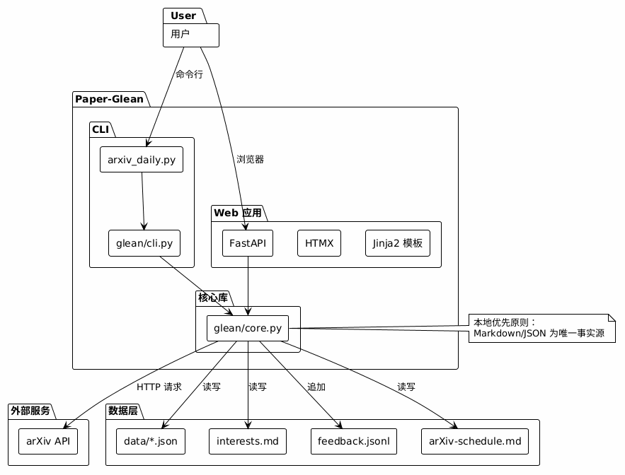
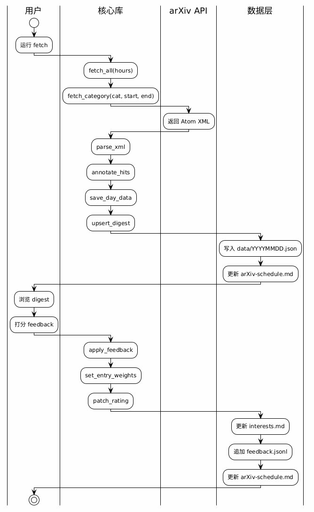

# 架构概览

> Paper-Glean 系统架构与模块关系

## 架构图



> 图源文件：[architecture.puml](../assets/diagrams/architecture.puml)

## 核心架构：脚本 + Agent 混合

```
┌─────────────────────────┐     ┌──────────────────────────────┐
│ arxiv_daily.py fetch    │ ──▶ │ arXiv-schedule.md (## YYYYMMDD) │
│ (确定性, 可独立定时运行) │     │ data/YYYYMMDD.json (原始数据)   │
└─────────────────────────┘     └──────────────┬───────────────┘
                                               │ agent (Qoder Quest) 阅读
                                               ▼
                                ┌──────────────────────────────┐
                                │ 填写 ★ 重点关注 / 🧐 视野扩展   │
                                │ arxiv_daily.py download <id>… │
                                │ → PDF 落盘到 $ARXIV_DIR (按命名规则)│
                                └──────────────────────────────┘
```

### 脚本层

- **确定性**：纯标准库 Python，无需 agent 即可独立运行
- **职责**：抓取、去重、生成 digest、关键词命中标记、下载 PDF
- **入口**：`arxiv_daily.py` / `glean/cli.py`

### Agent 层

- **语义理解**：读取 `data/*.json`、digest 与 `interests.md`
- **职责**：填写推荐小节、调用 download、解析新材料为兴趣条目
- **触发**：用户主动请求或定时任务

## 模块关系

```
glean/
├── core.py          # 纯业务逻辑（共享）
├── cli.py           # CLI 包装器（fetch/daily/serve/watch/ccf/download/feedback/reanchor）
├── serve.py         # 本地 Web 服务保活（探测 / 后台拉起 / ensure）
├── watch.py         # 学者监控（名单 / 解析编排 / 指纹 diff / 事件）
├── ccf.py           # 会议期刊监控（勾选框名单 / 目录同步 / 三源编排 / 指纹 diff）
├── ccf_catalog.py   # CCF-A 目录快照（71 会议 + 22 期刊，生成物，勿手改）
├── homeparse.py     # 个人主页启发式解析（stdlib html.parser，零依赖）
├── venueparse.py    # 会议/期刊页解析 + ccfddl RSS + Crossref 卷期（零依赖）
├── notify.py        # 推送四通道（file / desktop / webhook / Web NEW），双命名空间
├── config.py        # 常量与配置
└── web/
    ├── main.py      # FastAPI 应用工厂（含 watch_new_count / ccf_new_count 模板全局）
    ├── routes.py    # 路由定义（含 /api/ping、/api/watch/*、/api/ccf/*）
    ├── models.py    # Pydantic 模型
    └── templates/   # Jinja2 模板
```

> 仓库根另含 `scripts/`（`run_daily.ps1` / `register_task.ps1`），
> 提供 Windows 计划任务形式的定时入口；详见 [定时运行](../user-guide/scheduling.md)。

### 监控层

监控层有**三条并行、互不干扰**的线，共用 `notify.py` 的推送框架：

| 线 | 组织维度 | 来源 | 名单 | digest |
|----|---------|------|------|--------|
| `daily` | arXiv 类别 | arXiv API | 类别固定 | `arXiv-schedule.md` |
| `watch` | 人 | 个人主页 → DBLP → S2 | `watchlist.md` | `WATCH-digest.md` |
| `ccf` | 会议 / 期刊 | ccfddl RSS → 主页；期刊走 Crossref | `ccf.md`（勾选框） | `CCF-digest.md` |

**按人（`watch`）**：

- **按人而非按类别**：arXiv 日报抓「今天这些类别新增了什么」，监控抓「这几个人
  最近挂出了什么」——后者才能覆盖视频 / 技术报告 / talk。
- **解析顺序**：`homeparse`（主页，首选，唯一覆盖非论文）→ `fetch_dblp` → `fetch_s2`
  （兜底，且显式配置时并行合并去重）。
- **「新」的定义**：`fingerprint = sha1(规范化标题 + 可选 URL 主机指纹)`，
  与 `data/watch_state.json` 比对；首次运行建基线不推送。

**按会议/期刊（`ccf`）**：

- **勾选即订阅**：`ccf.md` 用 `- [x]` / `- [ ]` 表达启停，`[ ]` 的条目不会发起任何网络请求；
  `sync_catalog()` 只增补与刷新元数据，**绝不改动用户勾选**。
- **来源分工是有理由的，不是随意的**：CFP 有结构化来源（ccfddl RSS 带等级/领域/官网），
  就不该去猜 HTML；Program 与接收论文列表只存在于会议主页；
  期刊主页（ACM DL / IEEE Xplore）是 JS 渲染空壳，故改走 **Crossref 开放 API** 按 ISSN 取卷期。
- **期刊指纹的稳定性是刻意设计**：身份锚定 `(venue, volume, issue)`，标题只写
  `TODS Volume 51 Issue 4`，URL 固定用期刊主页——「同一期持续有新文章入库」不重复播报。
- **DBLP 不做抓取**：2026-09 起 dblp.org 全部端点返回 Anubis 反爬拦截页，
  `dblp` 字段降级为人工参考链接（这也是 `watch` 的 DBLP 兜底源当前静默返回空的原因）。

**推送（共用）**：

- `notify.push(items, day, namespace)` 串行调用各通道，任一通道失败均不影响其余。
- 两个**命名空间** `watch` / `ccf` 各自维护未读集合（`data/watch_new.json` / `data/ccf_new.json`），
  在一处「标记已读」不会清掉另一处。

### 数据流



> 图源文件：[data-flow.puml](../assets/diagrams/data-flow.puml)

## 设计原则

1. **本地优先**：数据全部落在本仓库内，可 Git 版本化、可离线、可随时退出
2. **Markdown/JSON 为唯一事实源**：Web 应用只是视图层
3. **CLI 永远是 fallback**：Web 挂了脚本照跑
4. **可解释推荐**：每条推荐能回答「为什么推荐给我」

## 技术栈

| 层次 | 技术 | 说明 |
|------|------|------|
| CLI | Python 标准库 | 零外部依赖 |
| Web 后端 | FastAPI | 异步 HTTP 框架 |
| Web 前端 | HTMX + Alpine.js | 服务器渲染 + 轻量交互 |
| 模板 | Jinja2 | 服务端 HTML 渲染 |
| 样式 | Tailwind CSS | 实用优先 CSS |
| 数据 | Markdown + JSON | 本地文件存储 |

## 延伸阅读

- [系统设计](system-design.md) — 分层架构、核心接口、数据流、关键机制、扩展点与并发现状
- [Web 层详解](web-layer.md) — FastAPI + HTMX 路由与模板细节
- [数据规范](data-schema.md) — 四个数据文件的精确 schema
- [界面设计规范](../design/index.md) — Web 界面的目标形态与交互契约
