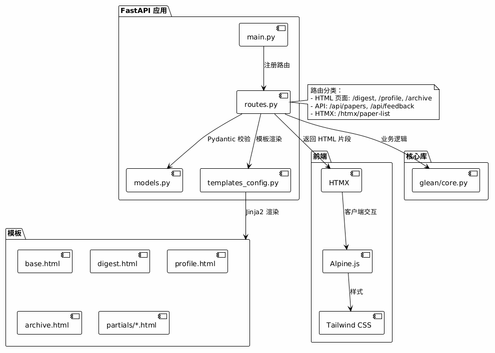

# Web 层详解

> FastAPI + HTMX + Alpine.js 实现

## 架构图



> 图源文件：[web-components.puml](../assets/diagrams/web-components.puml)

## 目录结构

```
glean/web/
├── __init__.py
├── __main__.py      # 入口：python -m glean.web
├── main.py          # FastAPI 应用工厂
├── routes.py        # 路由定义 + 三个共用助手
├── models.py        # 线上模型（Pydantic）+ PaperFilters（查询参数组）
├── templates_config.py  # 共享 Jinja2 环境 + 自定义过滤器
└── (模板在 glean/templates/)
```

> 模板目录是 `glean/templates/`（与 `glean/web/` 平级），不是 `glean/web/templates/`。

## 路由分类

### HTML 页面路由

| 路由 | 方法 | 说明 |
|------|------|------|
| `/` | GET | 重定向到 /digest |
| `/digest` | GET | Digest 流主页面 |
| `/profile` | GET | 兴趣画像页面 |
| `/archive` | GET | 归档库页面 |
| `/watch` | GET | 学者监控面板 |
| `/ccf` | GET | 会议期刊监控面板 |

### API 路由

| 路由 | 方法 | 说明 |
|------|------|------|
| `/api/ping` | GET | 存活探测（无副作用，供 `glean.serve` 与定时任务使用） |
| `/api/days` | GET | 获取所有可用日期（只含真正的日文件） |
| `/api/papers` | GET | 获取论文列表（筛选 + 分页） |
| `/api/papers/{paper_id}` | GET | 获取单篇论文详情 |
| `/api/interests` | GET | 获取兴趣画像条目 |
| `/api/feedback` | POST | 提交反馈打分 |
| `/api/download/{paper_id}` | POST | 下载 PDF |
| `/api/watch/*` | GET/POST/DELETE | 学者名单增删启停、`new` / `ack`、`events`、`run` |
| `/api/ccf/*` | GET/POST/DELETE | venue 增删启停、`toggle-area`、`refresh`、`new` / `ack`、`events`、`run` |

### HTMX 片段路由

| 路由 | 方法 | 说明 |
|------|------|------|
| `/htmx/paper-list` | GET | 论文列表片段（用于筛选后更新） |
| `/htmx/paper-card/{paper_id}` | GET | 单张卡片片段 |
| `/htmx/paper-detail/{paper_id}` | GET | 详情面板片段 |

## 共享筛选参数组

`/digest`、`/api/papers`、`/htmx/paper-list` 接受**完全相同的六个查询参数**，
并共用同一个过滤函数。为避免三处参数表漂移，参数组只在 `models.py` 声明一次，
由 FastAPI 按查询串注入：

```python
# glean/web/models.py
@dataclass
class PaperFilters:
    day: str | None = None
    category: str | None = None
    search: str | None = None
    show_star: bool = True
    show_expand: bool = True
    show_other: bool = False

# glean/web/routes.py
Filters = Annotated[PaperFilters, Depends()]

@router.get("/api/papers")
async def api_papers(filters: Filters, limit: int = Query(50, ge=1, le=200), ...):
    ...
```

> 用 `@dataclass` 而非 Pydantic 模型是**有意为之**：FastAPI 对 `BaseModel` 类型的参数
> 按**请求体**解析，只有普通类/数据类才会逐字段从查询串读取。
> 过滤优先级：`category` → `search` → 命中类型（★ 优先于 🧐，两者皆无则归入 Other），
> 最后按 `score_star + score_expand` 降序。

## 模板系统

### 模板环境

`templates_config.py` 只是对 Starlette `Jinja2Templates` 的一层薄封装，
提供目录常量、模板实例与 `format_timestamp` 过滤器：

```python
templates_dir = Path(__file__).resolve().parent.parent / "templates"
templates = Jinja2Templates(directory=str(templates_dir))

templates.env.filters["format_timestamp"] = format_timestamp
```

> **历史包袱已清除**：早期版本有 `NoCacheJinja2Templates` 子类，用来规避 Starlette
> 把渲染上下文塞进模板缓存 key 的缺陷（`TypeError: unhashable type: 'dict'`），
> 并因此依赖私有符号 `starlette.templating._TemplateResponse`。当前 Starlette
> 只按名字取模板、由 `TemplateResponse` 自行把 `request` 注入上下文，该子类已无必要，
> 连同私有依赖一并删除。
>
> 相应地，所有调用点使用现代签名 `TemplateResponse(request, name, context)`，
> 上下文里**不再需要**手写 `"request": request`。

### 模板契约（partials）

`partials/paper_card.html` 要求调用方提供两样东西：

| 变量 | 内容 |
|------|------|
| `paper` | 一条论文记录；`hits_star` / `hits_expand` 是**命中的关键词**（不是条目标题） |
| `interests` | `load_interest_entries()` 的结果（`title` / `keywords` / `weight`） |

「Why recommended」须用 `interest.keywords` 与 `hits_*` **求交集**来反查条目；
直接用 `interest.title in paper.hits_star` 会永远匹配不上。
论文记录的完整字段见[数据文件格式规范](data-schema.md#paper)。

### 模板继承链

```
base.html（导航项由单一列表生成，桌面/移动两种版式共用）
├── digest.html
│   └── partials/paper_list.html
│       └── partials/paper_card.html
├── partials/paper_detail.html
├── profile.html
├── archive.html
├── watch.html
└── ccf.html
```

## HTMX 模式

### 局部更新

筛选器变更时，HTMX 请求 `/htmx/paper-list` 并替换中间栏内容。六个筛选项必须**一起**提交，
因此每个控件都带同一个 `hx-include` 选择器（在 `digest.html` 里 `` 一次、复用六处）：

```html
<select name="category"
        hx-get="/htmx/paper-list"
        hx-target="#paper-list"
        hx-include="[name='day'], [name='category'], [name='search'],
                    [name='show_star'], [name='show_expand'], [name='show_other']">
```

日期下拉走的是整页 `/digest`（`hx-push-url="true"`），搜索框额外带
`hx-trigger="keyup changed delay:300ms"`。

### 卡片选择

点击卡片时，HTMX 加载详情到右侧面板（目标是 `#paper-detail`）：

```html
<div data-paper-id="{{ paper.id }}"
     hx-get="/htmx/paper-detail/{{ paper.id }}"
     hx-target="#paper-detail">
```

## Alpine.js 状态管理

`glean_static/js/app.js` 注册两个 Store（`alpine:init` 时挂载）：

| Store | 挂载点 | 职责 |
|-------|--------|------|
| `appStore()` | `<body>` | 键盘流：`j/k`（或 ↑/↓）移动选中、`1-5` 打分、`Shift+1-5` 打好奇分、`o` 打开、`d` 下载、`/` 聚焦搜索；监听 `htmx:afterSwap` 刷新 `[data-paper-id]` 列表 |
| `digestStore()` | `#paper-list` 所在容器 | 记录当前选中论文并切换卡片高亮 |

```javascript
Alpine.data('appStore', () => ({
    selectedPaperIndex: -1,
    papers: [],          // 由 updatePapers() 从 DOM 的 [data-paper-id] 收集

    init() { /* 收集 + 监听 htmx:afterSwap */ },
    updatePapers() { /* querySelectorAll('[data-paper-id]') */ },
    handleKeydown(event) { /* j/k · 1-5 · Shift+1-5 · o · d · / */ },
    navigatePaper(direction) { /* 移动高亮 + scrollIntoView + 触发卡片 hx-get */ },
    openSelectedPaper() { /* 打开 arXiv 链接 */ },
    downloadSelectedPaper() { /* htmx.ajax POST /api/download/{id} */ },
    rateSelectedPaper(kind, rating) { /* htmx.ajax POST /api/feedback */ },
}));
```

> 导航未读角标（`watch_new_count()` / `ccf_new_count()`）不是 Alpine 状态，
> 而是 `main.py` 注册的 Jinja 全局函数——每次页面渲染现算。

## 静态文件

```
glean_static/
├── css/
│   └── app.css         # 样式（Tailwind CDN + 自定义变量）
└── js/
    └── app.js          # Alpine.js 应用逻辑
```

静态文件通过 FastAPI 的 `StaticFiles` 挂载（目录存在才挂，便于纯 API 场景）：

```python
static_dir = Path(__file__).resolve().parent.parent.parent / "glean_static"
if static_dir.exists():
    app.mount("/static", StaticFiles(directory=str(static_dir)), name="static")
```
